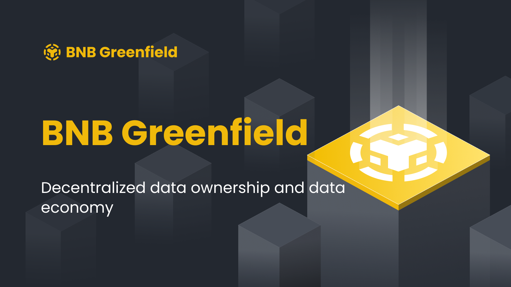

# Greenfield



Official Golang implementation of the Greenfield Blockchain. It uses [cometbft](https://github.com/cometbft/cometbft/)
for consensus and build on [cosmos-sdk](https://github.com/cosmos/cosmos-sdk).

BNB Greenfield aims to facilitate the decentralized data economy by simplifying the process of storing and managing data
access, as well as linking data ownership with the massive DeFi context of the BNB Smart Chain (BSC).

BNB Greenfield operates through three core components, which distinguish it from existing centralized and decentralized
storage systems::
- It enables Ethereum-compatible addresses to create and manage data and token assets seamlessly.
- It natively links data permissions and management logic onto BSC as exchangeable assets and smart contract programs,
thereby providing developers with a more efficient and flexible way of managing their data and permissions.
- It provides similar API primitives and performance as popular existing Web2 cloud storage systems.

These features offer a novel and innovative approach to decentralized data management and ownership in the DeFi space.
Overall, BNB Greenfield presents a promising solution for bringing greater flexibility, control, and efficiency to users
in the decentralized data economy.


## Disclaimer
**The software and related documentation are under active development, all subject to potential future change without 
notification and not ready for production use. The code and security audit have not been fully completed and not ready 
for any bug bounty. We advise you to be careful and experiment on the network at your own risk. Stay safe out there.**

## Greenfield Core

The center of BNB Greenfield are two layers:
1. A new storage-oriented blockchain, and
2. network composed of "storage providers".

This repo is the official implementation of Greenfield blockchain. 

The blockchain of BNB Greenfield serves a dual purpose of maintaining the ledger for users as well as the storage metadata
as common blockchain state data. The blockchain has its native token, BNB, which is transferred from the BNB Smart Chain,
and is utilized for gas and governance functionalities. Governance is further enabled through the staking logic that is
unique to the BNB Greenfield blockchain.

The Greenfield blockchain has two categories of states that are stored on-chain:

1. The ledger of accounts and their BNB balance

2. The metadata of the object storage system and service providers, along with the metadata of the objects stored on the
storage system, permission and billing information pertaining to the storage system.

Transactions on the Greenfield blockchain have the ability to modify the aforementioned on-chain states. These states and
the transactions that affect them are at the core of the economic data on the BNB Greenfield platform.

Users looking to create or access data on Greenfield may do so by engaging with the BNB Greenfield Core Infrastructure
through decentralized applications known as BNB Greenfield dApps. These dApps provide a user-friendly interface for
interacting with the platform, enabling users to create and manipulate data in a secure and decentralized environment.

## Documentation
Visit our official [documentation site](https://docs.bnbchain.org/greenfield-docs/docs/guide/introduction/overview) for more info.

## Quick Started

*Note*: Requires [Go 1.20+](https://go.dev/dl/)

```
## Build from source
make build

## start a private network with 3 validators and 3 storage providers
$ bash ./deployment/localup/localup.sh all  3 3

## query the key of the first validator
$ ./build/bin/gnfd keys list --home   $(pwd)/deployment/localup/.local/validator0   --keyring-backend test

## get the balance of an account
$ addr=`./build/bin/gnfd keys list --home   $(pwd)/deployment/localup/.local/validator0   --keyring-backend test|grep address|awk '{print $3}'`
$ ./build/bin/gnfd q bank balances $addr  --node tcp://127.0.0.1:26750 

## send BNB
$ ./build/bin/gnfd tx bank send validator0 0x73a4Cf67b46D7E4efbb95Fc6F59D64129299c2E3 100000000000000000000BNB --from validator0 -y --node tcp://127.0.0.1:26750 --home $(pwd)/deployment/localup/.local/validator0 --keyring-backend test  --broadcast-mode block

## stop the private chain
$ bash ./deployment/localup/localup.sh stop 

## restart the private chain
bash ./deployment/localup/localup.sh start 3 3
```

More advanced script and command line usage, please refer to the [Tutorial](https://docs.bnbchain.org/greenfield-docs/docs/api/blockchain-cli).

## Key Modules

- `x/bridge`: provide the cross-chain token transfer function, enabling BNB to flow freely between Greenfield and BSC
network with native support.
- `x/challenge`: generate random data challenge events or accept user's data challenge requests.
- `x/payment`: handle the billing and payment of the storage module. User fees are paid through "Stream" on Greenfield,
with a constant rate of payment from users to Storage Providers (SP) with charges applied every second of usage.
- `x/sp`: manage the various storage providers within the network.
- `x/storage`: users can manage their storage data through this module, like create/delete bucket, create/delete storage object.
- `x/permission`: user can manage its resource permission through this module, like put/delete policy for storage object.

And the following modules are in cosmos-sdk:

- `x/crosschain`: manage the cross chain packages, like store/query/update the cross chain package, channels, sequences.
- `x/gashub`: provide a governable and predictable fee charge mechanism.
- `x/oracle`: provide a secure runtime for cross chain packages.
- `x/staking`:  based on the Proof-of-Stake logic. The elected validators are responsible for the security of the Greenfield blockchain. 
They get involved in the governance and staking of the blockchain.

Refer to the [docs](https://docs.bnbchain.org/greenfield-docs/docs/guide/greenfield-blockchain/modules/storage-module) to dive deep into these modules.

## Running node

- [Interacting with the Node](https://docs.bnbchain.org/greenfield-docs/docs/guide/greenfield-blockchain/run-node/interact-node)
- [Run Local Network](https://docs.bnbchain.org/greenfield-docs/docs/guide/greenfield-blockchain/run-node/run-local-network)
- [Run Testnet Node](https://docs.bnbchain.org/greenfield-docs/docs/guide/greenfield-blockchain/run-node/run-testnet-node)
- [Become Testnet Validator](https://docs.bnbchain.org/greenfield-docs/docs/guide/greenfield-blockchain/run-node/become-testnet-validator)

## Related Projects
- [Greenfield-Contract](https://github.com/bnb-chain/greenfield-contracts): the cross chain contract for Greenfield that deployed on BSC network.
- [Greenfield-Tendermint](https://github.com/bnb-chain/greenfield-tendermint): the consensus layer of Greenfield blockchain.
- [Greenfield-Storage-Provider](https://github.com/bnb-chain/greenfield-storage-provider): the storage service infrastructures provided by either organizations or individuals.
- [Greenfield-Relayer](https://github.com/bnb-chain/greenfield-relayer): the service that relay cross chain package to both chains.
- [Greenfield-Cmd](https://github.com/bnb-chain/greenfield-cmd): the most powerful command line to interact with Greenfield system.
- [Awesome Cosmos](https://github.com/cosmos/awesome-cosmos): Collection of Cosmos related resources which also fits Greenfield.

## Contribution
Thank you for expressing your willingness to contribute to the Greenfield source code. We deeply appreciate any help, no
matter how small the fix. We welcome contributions from anyone on the internet, and we value your input.

If you're interested in contributing to Greenfield, please follow these steps:

1. Fork the project on GitHub.
2. Fix the issue.
3. Commit the changes.
4. Send a pull request for the maintainers to review and merge into the main codebase.

If you're planning to submit more complex changes, we kindly suggest that you reach out to the core developers first.
This could be done through a GitHub issue or our upcoming Discord channel. By doing so, you could ensure that your
changes are aligned with the project's general philosophy, and you can receive valuable feedback that will make your
efforts lighter as well as our review and merge procedures quick and simple.

Once again, thank you for your willingness to contribute to the Greenfield project. We look forward to working with you!

## Licence

The greenfield library (i.e. all code outside the `cmd` directory) is licensed under the
[GNU Lesser General Public License v3.0](https://www.gnu.org/licenses/lgpl-3.0.en.html),
also included in our repository in the `COPYING.LESSER` file.

The greenfield binaries (i.e. all code inside the `cmd` directory) is licensed under the
[GNU Affero General Public License v3.0](https://www.gnu.org/licenses/agpl-3.0.en.html), also
included in our repository in the `COPYING` file.
